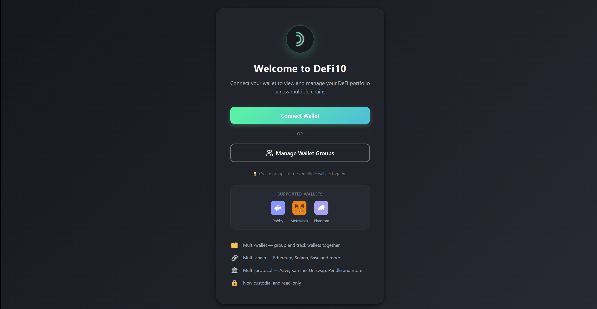
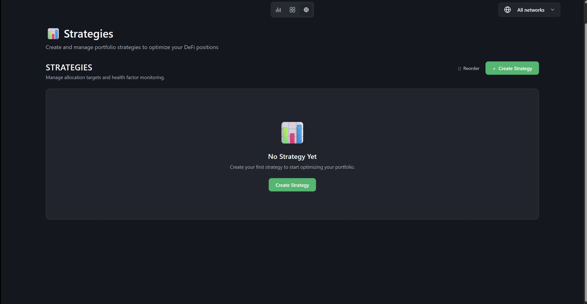

<div align="center">

<picture>
  <source media="(prefers-color-scheme: dark)" srcset="frontend/public/logo_extended.svg">
  <source media="(prefers-color-scheme: light)" srcset="frontend/public/logo_extended.svg">
  
</picture>

### Multi-Wallet · Multi-Chain · Multi-Protocol Aggregation Engine

> Event-driven platform for real-time aggregation of DeFi positions across wallets, blockchains, and protocols into a unified portfolio view.

[](https://www.rust-lang.org/)
[](https://react.dev/)
[](https://www.typescriptlang.org/)
[](https://playwright.dev/)

</div>

---

## Overview

DeFi10 aggregates DeFi positions from **multiple wallets**, **multiple protocols**, and **multiple blockchains** into a unified portfolio view — giving you a single dashboard to track, analyze, and manage your entire DeFi portfolio.

### Wallet Connection



Connect with **Rabby**, **MetaMask**, or **Phantom** to start tracking your portfolio. Supports both EVM and Solana wallets out of the box.

### Wallet Groups


Create **wallet groups** to track multiple addresses together. Add EVM and Solana wallets into a single group, optionally protect with a password, and share the group ID with others for read-only access.

### Portfolio Dashboard


Consolidated card view of all your DeFi positions — lending supplies, borrows, liquidity pools, and staking — aggregated across protocols and chains in real time.

### Portfolio Analytics


Interactive charts with multiple views — portfolio distribution by protocol and chain, asset allocation breakdown, yield projections over time, and historical performance tracking.

### Strategy Builder



Define and manage strategies for your DeFi positions. Set target allocations, configure Health Factor monitoring with custom thresholds and alerts, and build rebalancing rules — all saved per wallet group.

---

## Supported Chains & Protocols

**Chains:**
- EVM: Ethereum, Base, Arbitrum, BNB Smart Chain
- Solana

**Protocols:**
- Uniswap V3, Aave V3, Pendle V2
- Raydium, Kamino
- Token balances via Moralis

**Wallets:**
- Rabby, MetaMask (EVM)
- Phantom (Solana)

---

## Architecture

```
Frontend (React + Vite + TailwindCSS)
    ↓
REST API (Rust / Axum) → RabbitMQ → Workers → External APIs (Alchemy, Moralis)
                              ↓
                      Cache (Redis) + Storage (MongoDB)
```

**Key Patterns:**
- Event-driven architecture (RabbitMQ pub/sub)
- Intelligent retry with exponential backoff
- Distributed caching for prices and metadata
- Stateless workers for horizontal scaling
- JWT authentication with wallet group ownership

---

## Tech Stack

| Layer | Technologies |
|---|---|
| **Frontend** | React, TypeScript, Vite, TailwindCSS, Recharts |
| **Backend** | Rust, Axum, Tokio |
| **Infrastructure** | MongoDB, Redis, RabbitMQ, Docker |
| **Blockchain** | Alchemy, Moralis, Ethereum, Solana |
| **Testing** | Playwright (E2E), Jest, Rust tests |
| **CI/CD** | GitHub Actions, Render |

---

## Quick Start

### Prerequisites
- Rust (latest stable)
- Node.js 18+
- Redis, MongoDB, RabbitMQ

### Backend (Rust)

```bash
cd backend-rust
cp .env.example .env
# Edit .env with your API keys and connection strings
cargo run
```

**API:** `http://localhost:10000`

### Frontend

```bash
cd frontend
npm install
npm run dev
```

**App:** `http://localhost:5173`

### E2E Tests (Playwright)

```bash
cd e2e
npm install
npx playwright test
```

---

## Configuration

**Required services:**
- Alchemy (RPC provider)
- Moralis (token data)
- Redis (cache)
- MongoDB (storage)
- RabbitMQ (messaging)
- CoinMarketCap (price enrichment)

See [.env.example](backend-rust/.env.example) for full configuration.

---

## Docker

```bash
docker-compose up -d
```

See [docker-compose.yml](docker-compose.yml) for full setup.

---

## License

MIT License - [LICENSE](LICENSE)
