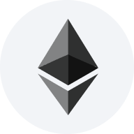
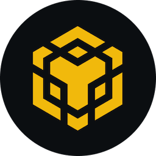
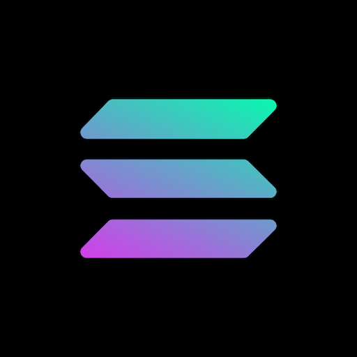

<div align="center">

<picture>
  <source media="(prefers-color-scheme: dark)" srcset="frontend/public/logo_extended.svg">
  <source media="(prefers-color-scheme: light)" srcset="frontend/public/logo_extended_light.svg">
  
</picture>

**Multi-chain DeFi Portfolio Tracker**

[](https://www.rust-lang.org/)
[](https://react.dev/)
[](https://www.typescriptlang.org/)
[](LICENSE)

</div>

---

## Supported Chains

<div>
  &nbsp;&nbsp;
  &nbsp;&nbsp;
  &nbsp;&nbsp;
  &nbsp;&nbsp;
  
</div>

## Integrated Protocols

<div>
  &nbsp;&nbsp;
  &nbsp;&nbsp;
  &nbsp;&nbsp;
  &nbsp;&nbsp;
  
</div>

---

## Architecture

```
Frontend (React + Vite)
        ↓
REST API (Rust / Axum)
        ↓
Workers (Tokio async tasks)
        ↓
External APIs (Alchemy, CoinGecko, The Graph)
        ↓
MongoDB + Redis
```

**Workspace crates:**

| Crate | Description |
|---|---|
| `api` | Axum HTTP server, handlers, auth middleware |
| `worker` | Background jobs: snapshot, sweep, aggregation |
| `protocols` | Protocol adapters: Uniswap, Kamino, Raydium, Aave |
| `infrastructure` | MongoDB repositories, Redis cache, CoinGecko client |
| `core` | Domain types: wallet groups, strategies, snapshots |
| `blockchain` | EVM and Solana RPC clients |
| `aggregation` | Aggregation orchestration and job management |

---

## Quick Start

### Prerequisites

- Rust 1.75+
- Node.js 18+ / Yarn
- MongoDB, Redis, RabbitMQ

### Backend

```bash
cd backend-rust

# Copy and configure environment
cp .env.example .env

# Run the API
cargo run -p defi10-api

# Run the worker
cargo run -p defi10-worker
```

**API:** `http://localhost:10000`  
**Health:** `http://localhost:10000/health`

### Frontend

```bash
cd frontend

yarn install
yarn dev
```

**App:** `http://localhost:10002`

---

## Environment Variables

| Variable | Description |
|---|---|
| `MongoDB__Uri` | MongoDB connection string |
| `MongoDB__Database` | Database name (default: `DeFi10`) |
| `Redis__Url` | Redis connection URL |
| `RabbitMQ__Url` | RabbitMQ AMQP URL |
| `Jwt__Secret` | JWT signing secret (min 256-bit) |
| `Jwt__ExpirationHours` | Token TTL in hours (default: `168`) |
| `Blockchain__AlchemyApiKey` | Alchemy API key for EVM RPC |
| `COINGECKO_API_KEY` | CoinGecko API key for price data |
| `Graph__ApiKey` | The Graph API key |
| `VITE_API_BASE_URL` | Backend API URL for the frontend |

---

## Development

### Rust

```bash
# Format
cargo fmt --manifest-path backend-rust/Cargo.toml --all

# Lint
cargo clippy --manifest-path backend-rust/Cargo.toml --all -- -D warnings

# Test
cargo test --manifest-path backend-rust/Cargo.toml --all
```

### Frontend

```bash
cd frontend

yarn lint      # ESLint + Prettier check
yarn build     # Production build
yarn test      # Unit tests
```

---

## Deployment

Deployed on [Render](https://render.com/) via `render.yaml`.

```bash
docker build -t defi10-api:latest .
```

Services defined in `render.yaml`:
- `defi10-api` — Rust API (Docker)
- `defi10-redis` — Managed Redis

---

## Support

- **Issues:** [GitHub Issues](https://github.com/ovictormagalhaes/DeFi10/issues)
- **Discussions:** [GitHub Discussions](https://github.com/ovictormagalhaes/DeFi10/discussions)

---

## License

MIT License — [LICENSE](LICENSE)
